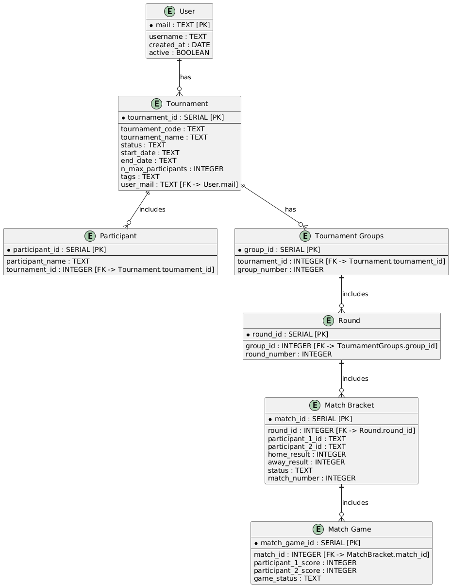

# Tournado

## Instrucciones para levantar

1. Dependencias globales

Este proyecto fue desarrollado con nextJs, por lo que para levantarlo es necesario tener instalado nodeJs y **pnpm**.

```bash
npm i -g pnpm
```

2. Vercel

Este proyecto fue desplegado en Vercel, aunque de momento solo yo tengo acceso a la configuración del proyecto, por lo que si deseas levantarlo en tu máquina local, necesitarás instalar Vercel CLI.

```bash
npm i -g vercel
```

3. configuración del environment

Este proyecto utiliza variables de entorno, por lo que es necesario crear un archivo `.env` en la raíz del proyecto con las siguientes variables:

```bash
POSTGRES_URL="**********"
POSTGRES_PRISMA_URL="**********"
POSTGRES_URL_NO_SSL="**********"
POSTGRES_URL_NON_POOLING="**********"
POSTGRES_USER="default"
POSTGRES_HOST="************"
POSTGRES_PASSWORD="**********"
POSTGRES_DATABASE="******************"

NEXTAUTH_URL=http://localhost:3000
AUTH_SECRET=**********

# https://authjs.dev/getting-started/providers/github
AUTH_GITHUB_ID=**********
AUTH_GITHUB_SECRET=**********
```	

Para usar la base de datos compartida escribeme para que te proporcione las variables de entorno. Sino puedes usar tu propia base de datos.

4. Levantar el proyecto

Antes no olvides verificar que tengas todas las dependencias instaladas con el siguiente comando:

```bash
pnpm install
```

El proyecto se puede levantar con el siguiente comando:

```bash
pnpm dev
```

# Lib Brackets Viewer.js

https://github.com/Drarig29/brackets-viewer.js
---

## Features

- **Dynamic Bracket Management**: Supports single/double elimination and round-robin tournaments.
- **Flexible Data Models**: Customize and integrate stages, rounds, groups, matches, and games.
- **Easy Integration**: Add tournament brackets seamlessly to your web applications.
- **Extensible Design**: Easily extend functionality to include metadata or custom visualizations.

---

## Installation

```bash
npm install brackets-viewer.js
```

---

## Data Model Overview

This library uses a structured data model to define the elements of a tournament. Below are the key entities:

### Participant

Represents a team or individual competing in the tournament.

```ts
interface Participant {
    id: string;
    tournament_id: string;
    name: string;
}
```

### Stage

Defines a stage in the tournament (e.g., round-robin, single elimination).

```ts
interface Stage {
    id: string;
    tournament_id: string;
    name: string;
    type: 'round-robin' | 'single-elimination' | 'double-elimination';
    settings: StageSettings;
    number: number;
}
```

### Group

Groups are logical units within a stage.

- **Round-robin stages**: Groups represent pools.
- **Elimination stages**: Groups represent brackets.

```ts
interface Group {
    id: string;
    stage_id: string;
    number: number;
}
```

### Round

Rounds group matches together within a stage.

```ts
interface Round {
    id: string;
    stage_id: string;
    group_id: string;
    number: number;
}
```

### Match

Defines a competition between two participants.

```ts
interface Match {
    id: string;
    stage_id: string;
    group_id: string;
    round_id: string;
    number: number;
    child_count: number; // Number of games in a "Best Of" match.
}
```

### Match Game

Represents a single game within a "Best Of" match.

```ts
interface MatchGame {
    id: string;
    stage_id: string;
    parent_id: string;
    number: number;
}
```

---

## Bracket Data Diagram (BDD)

Below is a visual representation of how data flows through the library:



---

## Key Concepts

### Groups in Elimination Stages

- **Single Elimination**:
  - Main Bracket.
  - Consolation Final (optional).
  
- **Double Elimination**:
  - Upper Bracket.
  - Lower Bracket.
  - Grand Final (optional).

### Round
- **Round-robin stages**: A collection of matches that can occur simultaneously.
- **Elimination stages**: Represents stages like quarter-finals or semi-finals.

### Match
- A competition between two participants.

### Match Game
- A sub-match within a "Best Of" series.

### BYE
- A placeholder used to balance tournament brackets when the number of participants is not a power of two.

---

